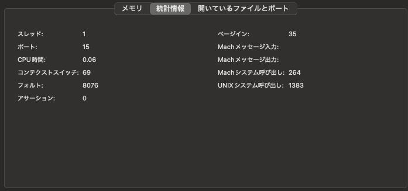

# memo

## 第4章

- p.73 ddとcpの違い
  - チャッピーに聞いたところ、ファイルシステムに依存するかどうからしい。ファイルシステムは第7章に出てくる
- p.82 _プロセスが仮想アドレスにアクセスした際に物理アドレスに変換するのはCPUの仕事です_
  - ぱっと見CPUがOSに依存している記述に見える。ページテーブルを管理するのはOS(Linux)で、それを利用するためにはCPUはOSに依存するしかないのでは？
  - チャッピーの解答
    - ハードウェア（MMU）が、ページテーブルの形式・階層・各エントリのビット（物理アドレス、アクセス権、フラグなど）を規定します。
    - OSは、そのハードウェア仕様に従ってページテーブルを作成・更新・管理します。
    - MMUはメモリ上のページテーブルを読み取り、仮想アドレスを物理アドレスに変換し、アクセス権チェックを行います。
    - OSがページテーブルを用意しない限り、通常は変換できません（ブート初期のページング無効や恒等マッピングなどの特例を除く）。
  - つまり、OSはCPUのアーキテクチャごとにページテーブルを作り分ける必要がある、という認識
  - https://www.intel.com/content/www/us/en/developer/articles/technical/intel-sdm.html の Combined Volume Set of Intel® 64 and IA-32 Architectures Software Developer’s Manuals pdfを見てみた(5252ページある。。。)
  - Vol. 3A 5-9 あたりにページテーブルの形式を定義していそう(32bitだが)。
- p.96 fault/sの計算
  - 大体1秒ごとに10MB分のページ数だけ、faultsが発生する。つまり、10MB/4096byte=2560。実際、sar -Bの結果を見ると大体あっている。
  - ところでPAGE_SIZEってシステムによって異なるんじゃないの？と思ってClaude Codeくんに聞いたところ、その通りだった。なので、本来`PAGE_SIZE = os.sysconf('SC_PAGE_SIZE')`とするのが良さそう
  - 実際、macOSでは`getconf PAGE_SIZE`すると16384だった
  - macOSの方でvm_statしながらdemand-paging.pyを実行すると、おおよそ900fault/sくらいだった。これは10MB/16384byte=610の方に近い(他のプロセスのfaultsも混じってしまっているが)
    - メモリ確保前 
      - Pythonランタイム自体のオーバーヘッドとかあるのだろう
    - メモリ確保後 
    - 8078 - 1662 = 6416 ... 610 x 10 = 6100にほぼピタリ 
- p.99 _x86_64アーキテクチャにおいて、仮想アドレス空間の大きさは128TiBで..._
  - ほんまか？ Table 5-1. Properties of Different Paging Modes を見ると、4-level page tablesの場合2**48byte=256TiB使えそうだけど
  - と思ってチャッピーに聞いたところ、上位128TiBがuser-spaceで、下位128TiBがkernel-spaceらしい
  - source: https://docs.kernel.org/arch/x86/x86_64/mm.html
    - 0000000000000000 |    0       | 00007fffffffefff | ~128 TB | user-space virtual memory, different per mm
    - ffff800000000000 | -128    TB | ffff87ffffffffff |    8 TB | ... guard hole, also reserved for hypervisor
- p.103 _データベースや仮想マシンマネージャなど、仮想メモリを大量に使うソフトウェアには、ヒュージページを使う設定が用意されていることがある_
  - 気になってTiDBについて調べてみたところ、**THPは切れ**と書いてあった。よしなにやってくれるのかな
    - https://docs.pingcap.com/tidb/stable/tune-operating-system/#disable-transparent-huge-pages-thp
  - 内部的に明示的にヒュージページを使っているかどうかはパッと分からなさそう
    - わんちゃんこの辺が関係あるかも: https://github.com/tikv/rocksdb/blob/b4ef4c1e0f80cf3c2b7196d03951efc6d8959c49/port/mmap.h#L28 by チャッピー
      - これは実際にはTiKVの内部で利用しているrocksdb

## 第5章

- p.116 _freeとawkをパイプで繋いで、freeコマンドの出力をawkコマンドの入力として与えます_
  - awk使えるようになりたい
- p.117 